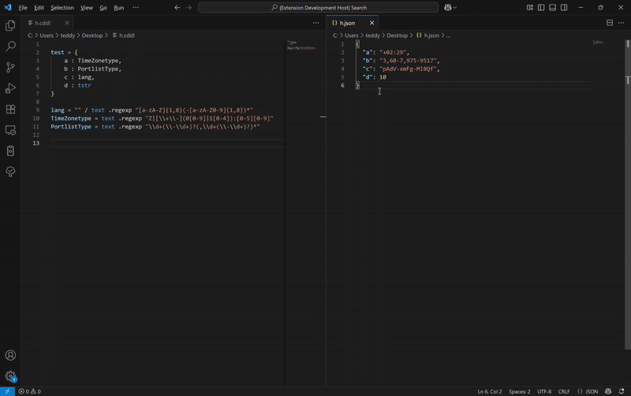

# cddl-extension README

This VS Code extension provides support for creating and editing [CDDL](https://datatracker.ietf.org/doc/html/rfc8610) documents, based on the [Ruby parser, generator, and validator](https://rubygems.org/gems/cddl/versions/0.12.11) and the [CDDL language server](https://github.com/anweiss/cddl).

## Features

- [x] Syntax highlighting
- [x] Intellisense
    - Standard prelude
    - Control operators
- [x] Verify conformance of CDDL documents against RFC 8610
- [x] Press <kbd>Alt</kbd> + <kbd>d</kbd> to generate dummy JSON from conformant CDDL

    

- [x] Press <kbd>Alt</kbd> + <kbd>v</kbd> to validate JSON document. JSON document and CDDL document must be visible side by side.
  
    

## Release Notes

see [CHANGELOG](CHANGELOG.md).

